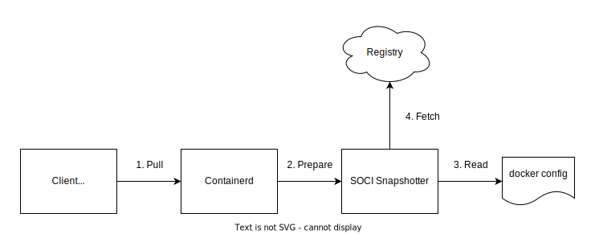
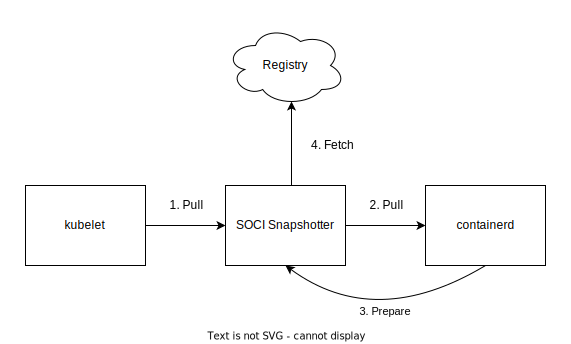
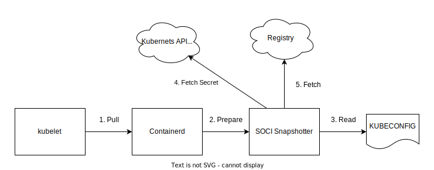

# Registry Authentication

This document outlines how to configure credentials for the SOCI snapshotter and SOCI CLI to authenticate with private repositories. 


<!-- START doctoc generated TOC please keep comment here to allow auto update -->
<!-- DON'T EDIT THIS SECTION, INSTEAD RE-RUN doctoc TO UPDATE -->
- [SOCI Snapshotter](#soci-snapshotter)
  - [Docker Config (default)](#docker-config-default)
    - [Architecture](#architecture)
    - [Configuration](#configuration)
    - [Features and Considerations](#features-and-considerations)
  - [Kubernetes CRI Credentials](#kubernetes-cri-credentials)
    - [Architecture](#architecture-1)
    - [Configuration](#configuration-1)
    - [Features and Considerations](#features-and-considerations-1)
  - [Kubernetes Secrets](#kubernetes-secrets)
    - [Architecture](#architecture-2)
    - [Configuration](#configuration-2)
    - [Features and Considerations](#features-and-considerations-2)
- [SOCI CLI](#soci-cli)
  - [Docker Config](#docker-config)
  - [Username + Password Parameter](#username--password-parameter)

<!-- END doctoc generated TOC please keep comment here to allow auto update -->

# SOCI Snapshotter

The SOCI Snapshotter supports 3 mechanisms for getting credentials:

1. [Docker Config (default)](#docker-config-default)
2. [Kubernetes CRI Credentials](#kubernetes-cri-credentials)
3. [Kubernetes Secrets](#kubernetes-secrets)

The SOCI snapshotter supports using a combination of these mechanisms. It will try each enabled option in the order specified above until it receives non-empty credentials. It will not will not try the next option if it receives invalid or expired credentials. The Docker config option is always enabled while CRI Credentials and Kubernetes secrets are disabled by default and can be enabled via the snapshotter's config.

## Docker Config (default)

By default, the SOCI snapshotter will load credentials from the Docker config in `$HOME/.docker/config.json` (note that the SOCI snapshotter requires root, so `$HOME` is the root user's home. Usually `/root`). It supports both credentials obtained via `docker login` or `nerdctl login` and external [credential helpers](https://docs.docker.com/reference/cli/docker/login/#credential-stores) such as [amazon-ecr-credential-helper](https://github.com/awslabs/amazon-ecr-credential-helper).

### Architecture



1. The client (e.g. nerdctl or the kubelet) pulls an image via containerd
2. Containerd calls the SOCI snapshotter to prepare a snapshot
3. The SOCI snapshotter reads the Docker config to get credentials  
    3a. The SOCI snapshotter loads the credentials directly if they are in config file (via `docker login` or `nerdctl login`)  
    3b. The SOCI snapshotter invokes a credential helper binary to get credentials if configured
4. The SOCI snapshotter uses the credentials to fetch content from the registry

### Configuration

The SOCI snapshotter doesn't need any configuration to use the Docker config. 

`$HOME/.docker/config.json` can be configured according to the [Docker documentation](https://docs.docker.com/reference/cli/docker/login/#configure-the-credential-store)

### Features and Considerations

**Supports Credential Rotation** - The SOCI snapshotter is able to reload and refresh credentials from the Docker config when they expire.

**Only Option Without Kubernetes** - This is the only solution outside of a kubernetes context. However, external credential helper processes can be used to connect the SOCI snapshotter with other secret managers.

**Requires Host Configuration** - The docker config lives on the host that runs the SOCI snapshotter. This adds extra burden for Kubernetes where every node needs to be configured out-of-band to have access to credentials.


## Kubernetes CRI Credentials

In this mode, the SOCI snapshotter acts as an ImageService proxy between the kubelet and containerd. When the kubelet pulls an image, it first calls the SOCI snapshotter. The SOCI snapshotter caches the credentials in the request and then forwards the request to containerd. When containerd calls back to the SOCI snapshotter to create a snapshot, the snapshotter loads the cached credentials to authenticate with the registry.

### Architecture


1. The kubelet calls the _SOCI snapshotter_ to pull the image (not containerd)  
    1a. The SOCI snapshotter extracts the credentials from the request and caches them in memory  
2. The SOCI snapshotter calls the containerd CRI implementation to pull the image  
3. Containerd calls the SOCI snapshotter to prepare a snapshot  
    3a. The SOCI snapshotter uses the image ref to lookup previously cached credentials  
4. The SOCI snapshotter uses the credentials to fetch content from the registry

### Configuration

This option needs configuration in SOCI (to enable the CRI keychain) and the kubelet (to use the SOCI ImageService proxy).


**SOCI snapshotter configuration**  
`/etc/soci-snapshotter-grpc/config.toml`

```toml
[cri_keychain]
# This tells the SOCI snapshotter to act as a proxy ImageService
# and to cache credentials from requests to pull images.
enable_keychain = true
# This tells the SOCI snapshotter where containerd's ImageService is located.
# The SOCI snapshotter will forward requests here after caching credentials.
image_service_path="/run/containerd/containerd.sock"
```

**Kubelet Configuration**  
The kubelet must be started with:
`--image-service-endpoint=unix:///run/soci-snapshotter-grpc/soci-snapshotter-grpc.sock`

### Features and Considerations

**Works With Both Kubernetes Secrets and Cred Helpers** - The kubelet passes credentials to the SOCI snapshotter, so any authentication mechanism that kubernetes understands will work in this configuration. 

**Kubernetes Only** - This option requires the CRI which is Kubernetes-specific

**No Credential Rotation** - Credentials are only passed from the kubelet when pulling the image and they cannot be refreshed. If the credentials expire before the image is fully downloaded, any requests for data that is not downloaded will fail unless another image from the same registry is pulled with fresh credentials. Files that are already downloaded will not be affected.

**In-memory Credentials** - Credentials are cached in-memory only and are lost if the SOCI-snapshotter retarts. Since credentials are lost, it may affect the ability for the node to recover. Images that have already been pulled according to containerd will not be able to re-establish connection to finish lazy loading which will behave similarly to credential expiration.

## Kubernetes Secrets

In this mode, the SOCI snapshotter will use a kubeconfig file to connect to a kubernetes API server to sync `kubernetes.io/dockerconfigjson` secrets. Secrets are continuously synced across all namespaces. The kubeconfig needs permission to `list` and `watch` secrets.

### Architecture 

1. The kubelet calls containerd to pull the image
2. Containerd calls the SOCI snapshotter to prepare a snapshot
3. The SOCI snapshotter reads the kubeconfig to configure a connection to the kubernetes API server
4. The SOCI snapshotter fetches credentials from the kubernetes API server
5. The SOCI snapshotter uses the credentials to fetch content from the registry

### Configuration

This option needs configuration in the SOCI snapshotter (to enable the kubeconfig keychain)

**SOCI snapshotter configuration**  
`/etc/soci-snapshotter-grpc/config.toml`

```toml
[kubeconfig_keychain]
# This tells the SOCI snapshotter to act as a proxy ImageService
# and to cache credentials from requests to pull images.
enable_keychain=true
# This tells the SOCI snapshotter where to find the kubeconfig. 
# If not set, the snapshotter will look in the k8s default $HOME/kube/config
kubeconfig_path="/path/to/kubeconfig"
```

### Features and Considerations

**Supports Credential Rotation** - The SOCI snapshotter constantly syncs secret in the background. If credentials expire, the SOCI snapshotter will refresh them with the latest secret value.

**Kubernetes Only** - This option relies on the kubernetes API server.

**Supports Snapshotter Restarts** - When the SOCI snapshotter restarts, it is able to reconnect to and resync credentials from the API server.

**Only supports secrets** - This option does not work with credential helpers.

**Syncs Credentials in all Namespaces** - The SOCI snapshotter is unaware of which namespaces will land on this host and so it will sync secrets in all namespaces.

# SOCI CLI

The SOCI CLI supports 2 mechanisms for getting registry credentials when pushing SOCI indexes:

1. [Docker Config](#docker-config)
2. [Explicit username/password via a parameter](#username--password-parameter)

The SOCI CLI will use an explicit parameter if provided, then attempt to load credentials from docker config.

## Docker Config

Like the SOCI snapshotter, the SOCI CLI can load credentials from the Docker config in `$HOME/.docker/config.json` (note that the SOCI CLI requires root, so `$HOME` is the root user's home. Usually `/root`). It supports both credentials obtained via `docker login` or `nerdctl login` and external [credential helpers](https://docs.docker.com/reference/cli/docker/login/#credential-stores) such as [amazon-ecr-credential-helper](https://github.com/awslabs/amazon-ecr-credential-helper).

## Username + Password Parameter

The SOCI CLI can also receive credentials via the `--user` parameter which accepts a `USERNAME:PASSWORD` string. E.g.:

```
# ECR_TOKEN = $(aws ecr get-login-password)
# soci push --user AWS:$ECR_TOKEN $IMAGE
```

NOTE: This method will record the password in shell history if you do not use an environment variable like in the example.
